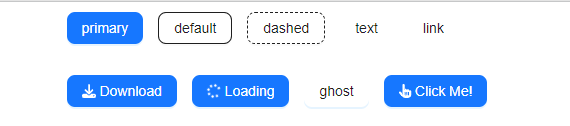

# diffstylebutton

> Made with create-react-library

[](https://www.npmjs.com/package/diffstylebutton) [](https://standardjs.com)



## Install

```bash
npm install --save diffstylebutton
```

## Usage

```jsx
import React, { Component } from 'react'

import MyComponent from 'diffstylebutton'
import 'diffstylebutton/dist/index.css'

class Example extends Component {
  render() {
    return <MyComponent />
  }
}
```

## License

MIT © [beyza-armagan](https://github.com/beyza-armagan)
